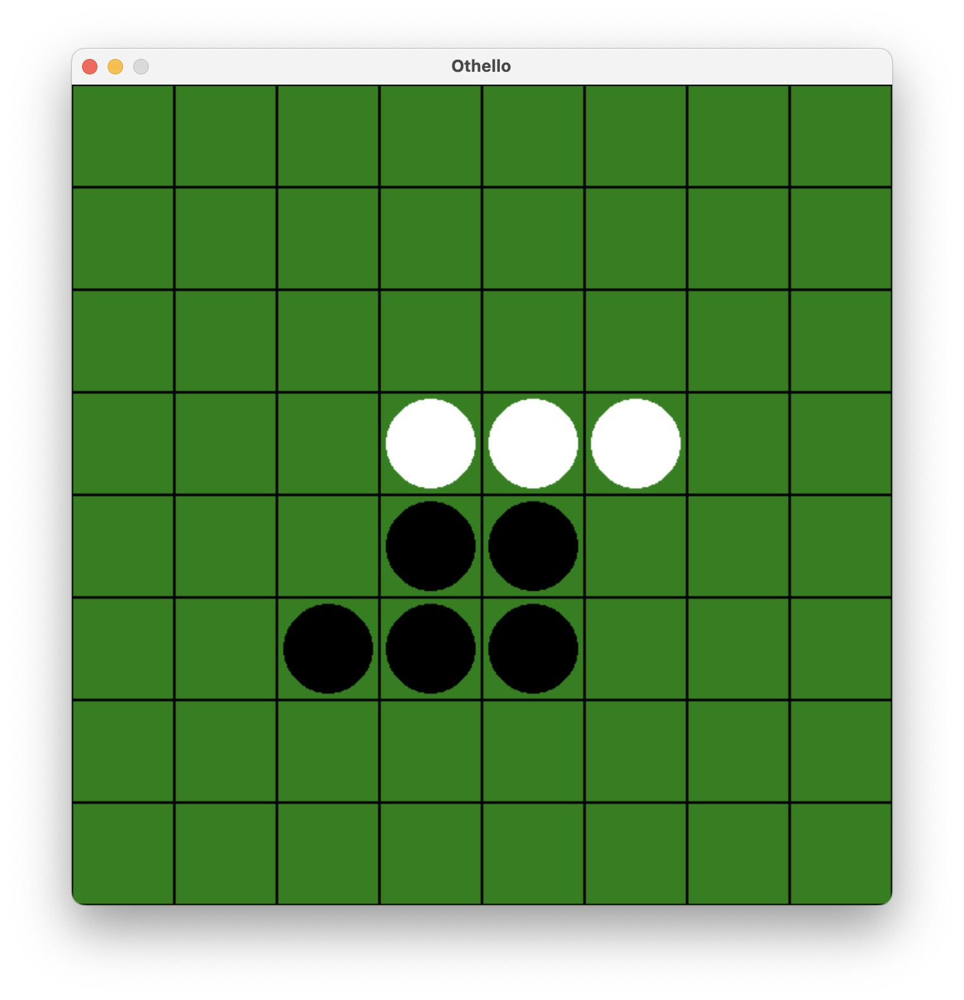

# 🎮 Othello Game (Python + Pygame)

Python の Pygame ライブラリを使ったシンプルなオセロ（リバーシ）ゲームです。  
黒石 vs 白石で交互に打ち、勝敗がついたら「New Game」または「Quit」の選択画面が表示されます。

---

## 🖥️ プレイ方法

1. 画面をクリックして、石を置ける場所に置きます。
2. 石を置くと、相手の石が裏返ります（通常のオセロのルールに従います）。
3. 双方が置けなくなった時点で勝敗が決定します。
4. 勝敗表示後、「New Game」か「Quit」を選んでください。

---

## 📦 必要なライブラリ

- Python 3.7+
- Pygame 2.0+

このゲームは [Pygame](https://www.pygame.org/) を使用しています。  
依存ライブラリはすべて `requirements.txt` に記載されています。

---

## 🚀 実行方法

### 1. 仮想環境の作成（推奨）

```bash
python3 -m venv venv
source venv/bin/activate
```

### 2. ライラリのインストール

```bash
pip install -r requirements.txt
```

### 3. ゲームの起動

```bash
python othello.py
```

---

## 📁 ファイル構成

```
othello/
├── othello.py       # メインのゲームロジック
├── requirements.txt # 依存ライブラリ一覧（pygame含む）
└── README.md        # このファイル
```

---

## 🧠 実装されている機能

- 石の置ける場所の自動判定
- 石を裏返す処理
- ターンの自動交代
- 打てる手がない場合のスキップ処理
- ゲーム終了時の勝敗判定と表示
- 「New Game」または「Quit」選択画面

---

## 🎨 スクリーンショット



---

## 🛠️ 今後の拡張アイデア

- ヒント機能（置ける場所をハイライト）
- 対AI戦モード
- タイマー追加
- スコア履歴の記録

---

## 📜 ライセンス

MIT License

- [MIT License](https://opensource.org/licenses/MIT)
- [Pygame License](https://www.pygame.org/wiki/license)
- [Python License](https://docs.python.org/3/license.html)
